

  

  

---

## ⚔️ Hunter Status Window (Git Profile Awaken)

<!-- AWAKEN:START -->
<!-- Generated by git-profile-awaken. Edit awaken.json instead of this block. -->

<picture><source media="(prefers-color-scheme: dark)" srcset="awaken/hunter-dark.svg"><source media="(prefers-color-scheme: light)" srcset="awaken/hunter-light.svg"></picture>

<picture><source media="(prefers-color-scheme: dark)" srcset="awaken/ladder-dark.svg"><source media="(prefers-color-scheme: light)" srcset="awaken/ladder-light.svg"></picture>

<picture><source media="(prefers-color-scheme: dark)" srcset="awaken/web-dark.svg"><source media="(prefers-color-scheme: light)" srcset="awaken/web-light.svg"></picture>
<picture><source media="(prefers-color-scheme: dark)" srcset="awaken/skills-dark.svg"><source media="(prefers-color-scheme: light)" srcset="awaken/skills-light.svg"></picture>

<picture><source media="(prefers-color-scheme: dark)" srcset="awaken/activity-dark.svg"><source media="(prefers-color-scheme: light)" srcset="awaken/activity-light.svg"></picture>

<picture><source media="(prefers-color-scheme: dark)" srcset="awaken/quest-dark.svg"><source media="(prefers-color-scheme: light)" srcset="awaken/quest-light.svg"></picture>
<picture><source media="(prefers-color-scheme: dark)" srcset="awaken/contribution-dark.svg"><source media="(prefers-color-scheme: light)" srcset="awaken/contribution-light.svg"></picture>

<a href="https://github.com/HTP8888/zabbix-network-incident-simulator"><picture><source media="(prefers-color-scheme: dark)" srcset="awaken/spotlight-1-dark.svg"><source media="(prefers-color-scheme: light)" srcset="awaken/spotlight-1-light.svg"></picture></a>
<a href="https://github.com/HTP8888/Zabbix-LAB-Set-up-Tutorials-Ver-7.0"><picture><source media="(prefers-color-scheme: dark)" srcset="awaken/spotlight-2-dark.svg"><source media="(prefers-color-scheme: light)" srcset="awaken/spotlight-2-light.svg"></picture></a>

<a href="https://github.com/HTP8888/HOTEL69"><picture><source media="(prefers-color-scheme: dark)" srcset="awaken/spotlight-3-dark.svg"><source media="(prefers-color-scheme: light)" srcset="awaken/spotlight-3-light.svg"></picture></a>

<picture><source media="(prefers-color-scheme: dark)" srcset="awaken/oracle-dark.svg"><source media="(prefers-color-scheme: light)" srcset="awaken/oracle-light.svg"></picture>
<picture><source media="(prefers-color-scheme: dark)" srcset="awaken/daily-dark.svg"><source media="(prefers-color-scheme: light)" srcset="awaken/daily-light.svg"></picture>

<picture><source media="(prefers-color-scheme: dark)" srcset="awaken/rune-str-dark.svg"><source media="(prefers-color-scheme: light)" srcset="awaken/rune-str-light.svg"></picture>
<picture><source media="(prefers-color-scheme: dark)" srcset="awaken/rune-agi-dark.svg"><source media="(prefers-color-scheme: light)" srcset="awaken/rune-agi-light.svg"></picture>
<picture><source media="(prefers-color-scheme: dark)" srcset="awaken/rune-int-dark.svg"><source media="(prefers-color-scheme: light)" srcset="awaken/rune-int-light.svg"></picture>
<picture><source media="(prefers-color-scheme: dark)" srcset="awaken/rune-vit-dark.svg"><source media="(prefers-color-scheme: light)" srcset="awaken/rune-vit-light.svg"></picture>

<picture><source media="(prefers-color-scheme: dark)" srcset="awaken/rune-luk-dark.svg"><source media="(prefers-color-scheme: light)" srcset="awaken/rune-luk-light.svg"></picture>
<picture><source media="(prefers-color-scheme: dark)" srcset="awaken/rune-cha-dark.svg"><source media="(prefers-color-scheme: light)" srcset="awaken/rune-cha-light.svg"></picture>

<!-- AWAKEN:END -->

---

## 👨‍💻 Giới thiệu bản thân

<table align="center" width="100%">
  <tr>
    <td width="60%" valign="top">
      
Xin chào! Mình là <b>Hoàng Trần Phong</b>, sinh ra và lớn lên ở <b>Nghệ An</b>, đã tốt nghiệp <b>PTIT</b>.

      
🎓 Tốt nghiệp ngành <b>Điện tử - Viễn thông</b>, chuyên ngành <b>Mạng và Dịch vụ Internet</b> tại Học viện Công nghệ Bưu chính Viễn thông (<b>PTIT</b>).

      
💡 Đam mê mãnh liệt với <b>giám sát hệ thống (System Monitoring)</b>, hạ tầng máy chủ, tự động hóa mạng và nghiên cứu chuyên sâu về <b>công nghệ truy nhập quang thế hệ mới (XGS-PON)</b>.

    </td>
    <td width="40%" valign="top">
      <h3>📍 Thông tin nhanh</h3>
      <ul>
        <li>📍 <b>Vị trí:</b> Hà Nội, Việt Nam</li>
        <li>🕐 <b>Múi giờ:</b> UTC +07:00 (GMT+7)</li>
        <li>📧 <b>Email:</b> <a href="mailto:phonght.b21vt339@stu.ptit.edu.vn">phonght.b21vt339@stu.ptit.edu.vn</a></li>
        <li>🌐 <b>Website:</b> <a href="https://htp8888.github.io/my-website/">htp8888.github.io</a></li>
        <li>📘 <b>Facebook:</b> <a href="https://www.facebook.com/phonglanne999/">Hoàng Trần Phong</a></li>
      </ul>
    </td>
  </tr>
</table>

---

## 🛠️ Kỹ năng công nghệ

  <b>🔍 System Monitoring & Networking</b> 
  
  
  
  
  

  <b>💻 Infrastructure, Cloud & DevOps</b> 
  
  
  
  
  
  
  

  <b>⚡ Programming & Scripting</b> 
  
  
  
  
  
  

  <b>📡 Telecom & Optical Network</b> 
  
  
  
  

---

## 🚀 Dự án nổi bật

| Dự án | Mô tả chi tiết | Công nghệ chính | Liên kết |
| :--- | :--- | :--- | :--- |
| 🤖 **Zabbix Incident Sim** | Bộ giả lập sự cố mạng & chỉ số thiết bị trạm BTS qua Zabbix API | Python, Zabbix API, Systemd | [🤖 Repository](https://github.com/HTP8888/zabbix-network-incident-simulator) |
| 📊 **Zabbix 7.0 LTS Tutorials** | Hướng dẫn cài đặt và triển khai giám sát hệ thống Zabbix 7.0 LTS Server trên Ubuntu | Zabbix 7.0, Ubuntu, Shell | [📊 Repository](https://github.com/HTP8888/Zabbix-LAB-Set-up-Tutorials-Ver-7.0) |
| 📶 **3G / 4G / 5G Network Sim** | Mô phỏng kiến trúc hệ thống mạng viễn thông thế hệ mới (3G, 4G, 5G) | 3G/4G/5G, Telecom | [📶 Repository](https://github.com/HTP8888/SImulate-Generative-Network-System) |
| 🌐 **CCNA Learning Hub** | Tổng hợp kiến thức, cấu hình lab chuyển mạch, định tuyến và ôn tập CCNA | Cisco IOS, Routing, Switching | [🌐 Repository](https://github.com/HTP8888/ccna-learning-hub) |
| 📂 **SDN & NFV Research** | Nghiên cứu mạng định nghĩa bằng phần mềm và ảo hóa chức năng mạng | OpenFlow, Mininet, SDN | [📂 Repository](https://github.com/HTP8888/SDN-NFV) |
| ☕ **Lập trình mạng Socket** | Lập trình mạng hướng đối tượng, Socket TCP/UDP Client-Server đa luồng | Java Core, Socket | [☕ Repository](https://github.com/HTP8888/LAP-TRINH-MANG) |
| 🏨 **Hotel69** | Phần mềm quản lý khách sạn nâng cao với giao diện trực quan | Java, Swing, MySQL | [🏨 Repository](https://github.com/HTP8888/HOTEL69) |
| ⚡ **TFT Anti-Crash Optimizer** | Công cụ tối ưu hóa tiến trình hệ thống, dọn dẹp tài nguyên và chống crash | Windows, Optimization | [⚡ Repository](https://github.com/HTP8888/tft-anti-crash-optimizer) |
| 🌐 **My Portfolio Website** | Portfolio cá nhân với thiết kế responsive đẹp mắt | HTML5, CSS3, JS | [🌐 Live Demo](https://htp8888.github.io/my-website/) |

---

## 🎯 Sở thích & Góc cá nhân
* ⚽ Fan trung thành của câu lạc bộ **Chelsea FC** 💙 (*Keep The Blue Flag Flying High!*)
* 🍜 Có niềm đam mê mãnh liệt với món **Bún bò Huế** vào cuối tuần.
* 💻 Thích vọc vạch, cấu hình lab mạng thực tế và hệ thống High Availability.
